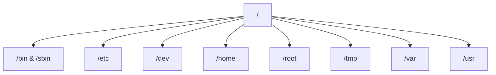

# The Root Directory

The entire Linux file system starts at a single point called root. It is represented by a forward slash (/). Every file and folder on the system exists somewhere under this root. There are no separate drive letters like C: or D:. Everything is part of one large tree.

# Key System Directories

**/bin and /sbin** These folders contain **essential programs**. /bin holds commands for all users, like `ls` and `cp`. /sbin holds commands for system administrators, like `shutdown` and `fdisk`.

**/etc** This folder stores all **system configuration files**. If we want to change how the network works or how users log in, we edit files here. It does not contain binary programs, only text-based settings.

**/dev** This folder contains **device files**. In Linux, hardware like hard drives, keyboards, and printers are treated as files. We do not install drivers in the traditional sense; the system accesses hardware through these files.

**/home** This folder **contains a subfolder for every user on the system**. If your username is "john", your personal files are in `/home/john`. This is where you save documents, downloads, and pictures.

**/root** This is the **home directory for the administrator (root) user.** It is separate from `/home` for security reasons. Regular users cannot access this folder.

**/tmp** This folder holds **temporary files**. Programs use it to store data they only need for a short time. The system often deletes everything in this folder when you restart the computer.

**/var** This folder holds **variable data that changes frequently**. It contains system logs, email queues, and database files. If you need to check why an error occurred, you usually look in `/var/log`.

**/usr** This folder contains **user applications and libraries**. Most software you install, like web browsers or code editors, lives here. It is similar to "Program Files" in Windows but organized differently.

# Absolute vs Relative Paths

An absolute path starts from the root (/). It tells the system exactly where a file is, no matter where you are currently standing. Example: `/home/john/Documents/file.txt`.

A relative path starts from your current location. It does not begin with a slash. If you are already in `/home/john`, you can just type `Documents/file.txt`.

# Special Directory Symbols

**`.` (Dot)** This represents the current directory you are in right now. It is useful when you want to run a script located in your current folder.

**`..` (Dot Dot)** This represents the parent directory, or the folder one level up. If you are in `/home/john/Documents`, typing `cd ..` moves you back to `/home/john`.

**`~` (Tilde)** This represents your home directory. Typing `cd ~` always takes you back to your personal folder, regardless of where you are in the system.

# Managing Directories

**Creating Folders** Use `mkdir folder_name` to create a new folder. If you need to create a folder inside another folder that doesn't exist yet, use `mkdir -p parent/child`. The `-p` flag creates all necessary parent folders automatically.

**Removing Folders** Use `rmdir folder_name` to delete a folder. This only works if the folder is completely empty. If there are files inside, you must use `rm -r folder_name` to delete the folder and its contents together.

**Moving and Renaming** Use `mv old_name new_name` to rename a folder. Use `mv folder_name /new/location` to move it. In Linux, moving and renaming are handled by the same command.

**Listing Contents** Use `ls` to see what is inside a folder. Use `ls -a` to see hidden files (those starting with a dot). Use `ls -l` to see detailed information like file size and permissions.