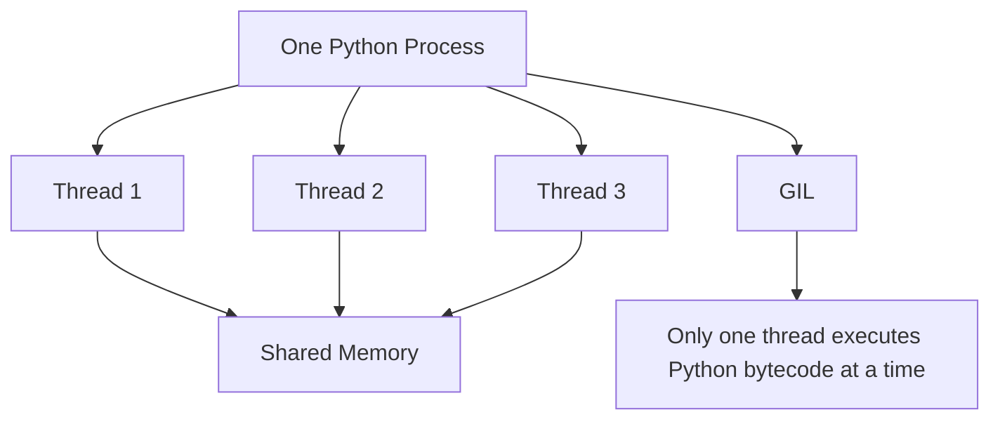
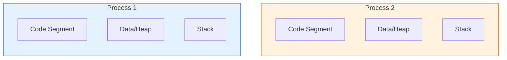
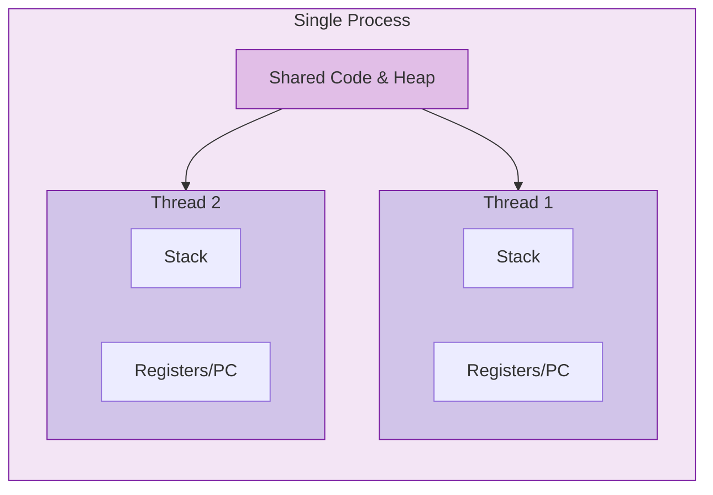

# Multithreading

- **Multithreading** allows a single program (process) to perform multiple operations "at the same time" by using sub-tasks called **threads**.

- **Shared Memory:** All threads within a process share the same memory space, making it easy for them to access the same variables and data.



## What is a Process?

- An independent program in execution with its own isolated memory space and system resources.
- Has a unique Process ID and is managed directly by the operating system scheduler.



## What is a Thread?

- A lightweight sub-unit of execution that exists within a process and shares its memory.
- Shares the same code, data, and files as other threads in the same process but has its own stack.
- Faster to create and switch between than processes.
- Requires careful handling to avoid data conflicts.



## Behind the Scenes

At the CPython level, multithreading is essentially a coordinated turn-taking system managed by the interpreter’s main evaluation loop. Each thread has its own private execution state (tracking things like local variables and the current instruction), but they all share the same global memory and must pass through a single gate: the GIL. The interpreter enforces fairness by using a simple counter; after executing a fixed number of bytecode instructions or a set time interval, the running thread is forced to release the GIL and signal waiting threads. When a thread performs an I/O operation or calls certain C extensions, the interpreter explicitly unlocks the GIL before handing off to the external system, allowing other Python threads to acquire it and continue executing bytecode while the first thread waits. This entire mechanism happens inside the interpreter’s core loop, ensuring that only one thread ever manipulates Python objects at a time, keeping memory management safe without requiring complex locking on every individual object.

## **Problems in Single-Threaded Programs**

- Program freezes completely while waiting for slow tasks like downloads or database queries.
- User interfaces become unresponsive because the main thread is blocked by background work.
- CPU sits idle and wasted during long I/O waits instead of handling other tasks.
- Independent tasks must run one after another, leading to unnecessarily long total execution times.

## **How Multithreading Solves These**

- Allows the program to continue running other logic while waiting for external data (network, disk, DB).
- Keeps applications snappy by offloading heavy waiting or background tasks to separate threads.
- Maximizes CPU usage by switching to a ready-to-run thread whenever the current one is waiting.
- Enables handling multiple independent requests or operations simultaneously without blocking the main flow.

# Few Examples ( to understand )
### Sequential Execution

```
# SEQUENTIAL EXECUTION
import threading

def eat():
    print("finished eating")
def drink():
    print("finished drinking")
def code():
    print("finished coding")

t1 = threading.Thread(target=eat)
t2 = threading.Thread(target=drink)
t3 = threading.Thread(target=code)

t1.start()
t2.start()
t3.start()
```
1. The OS schedules the three threads to run, but because the tasks are instant, they often execute sequentially or in a random race depending on CPU timing.
2. There is no guaranteed order; `eat`, `drink`, and `code` compete for the GIL and whichever grabs it first prints its message immediately.
3. Since there is no waiting (`sleep`), the total time is nearly zero, making it look like a standard top-to-bottom script even though multiple threads were technically active.

### Concurrent Execution

```
# CONCURRENT EXECUTION
import threading
import time

def eat():
    time.sleep(3)
    print("finished eating")
def drink():
    time.sleep(2)
    print("finished drinking")
def code():
    time.sleep(5)
    print("finished coding")

t1 = threading.Thread(target=eat)
t2 = threading.Thread(target=drink)
t3 = threading.Thread(target=code)

t1.start()
t2.start()
t3.start()
```

**For understanding:**

| Time   | Thread 1 (`eat`)                            | Thread 2 (`drink`)                          | Thread 3 (`code`)                          |
| ------ | ------------------------------------------- | ------------------------------------------- | ------------------------------------------ |
| **0s** | Starts sleeping 🛌                          | Starts sleeping 🛌                          | Starts sleeping 🛌                         |
| **2s** | Still sleeping 😴                           | **Wakes up & Prints** "finished drinking" ☕ | Still sleeping 😴                          |
| **3s** | **Wakes up & Prints** "finished eating" 🍽️ | Done ✅                                      | Still sleeping 😴                          |
| **5s** | Done ✅                                      | Done ✅                                      | **Wakes up & Prints** "finished coding" 💻 |
The print statements don't appear all at once. They appear **as soon as each specific thread finishes its own wait time**.

- Because `drink` only waits 2 seconds, it prints first.
- Because `code` waits 5 seconds, it prints last.

But there was a problem with this:
Main program continues immediately while threads are still working.

```
# CONCURRENT EXECUTION WITHOUT THREAD SYNCHRONIZATION
import threading
import time

def eat():
    time.sleep(3)
    print("finished eating")
def drink():
    time.sleep(2)
    print("finished drinking")
def code():
    time.sleep(5)
    print("finished coding")

t1 = threading.Thread(target=eat)
t2 = threading.Thread(target=drink)
t3 = threading.Thread(target=code)

t1.start()
t2.start()
t3.start()

print("main program finished")
```

This would return:

```
main program finished
finished drinking
finished eating
finished coding
```

Which isn't how it is supposed to.

Hence, here came the need of  `.join()`

**Without `.join()`:**

The main script doesn't care about the threads. It will immediately run the next line (like a `print` statement) while the threads are still sleeping in the background.

**With `.join()`:**

The main script hits a "roadblock" and refuses to move to the next line until all threads have finished their work.

```
# CONCURRENT EXECUTION WITH THREAD SYNCRONIZATION
import threading
import time

def eat():
    time.sleep(3)
    print("finished eating")
def drink():
    time.sleep(2)
    print("finished drinking")
def code():
    time.sleep(5)
    print("finished coding")

t1 = threading.Thread(target=eat)
t2 = threading.Thread(target=drink)
t3 = threading.Thread(target=code)

t1.start()
t2.start()
t3.start()

t1.join()
t2.join()
t3.join()

print("main program finished")
```

So, now this would give:

```
finished drinking
finished eating
finished coding
main program finished
```

